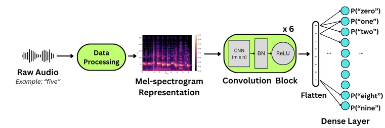

# ai-wake-up
AI Wake Up Call Challenge

Team:
Joey Ah-kiow
Baleegh Ahmad
Vineet Bhat
Luca Collini

# Architecture

## ML Model
Raw audio signals are typically transformed into Mel Frequency Cepstral Coefficients (MFCCs) or Mel-Spectrograms to facilitate the extraction of salient features across temporal, frequency, and amplitude domains. This preprocessing step is fundamental to numerous speech-based machine learning methodologies. The resultant data can be used to train a variety of machine learning models, including Convolutional Neural Networks (CNNs) and Recurrent Neural Networks (RNNs), for keyword spotting, leveraging a suitable open-source dataset. 

In this work, we investigate the use of mel-spectrogram-based feature extraction alongside a lightweight CNN-based network for keyword spotting.
Our model is composed of six blocks, each containing a CNN layer, batch normalization, and ReLU activation. The hierarchical convolution operations progressively reduce the dimensionality of the 2D data while enhancing the feature maps, thereby capturing a more profound representation of the input. After processing through these six blocks, the output is flattened and passed through a feed-forward network, culminating in a softmax activation that produces the probabilities for each class. The figure below illustrates our proposed ML pipeline for spotting keywords in ten digit classes.

The convolutional layers at the beginning of the model utilize larger kernel sizes, which are gradually reduced to decrease the overall number of trainable parameters.Specifically, Layer 1 has a kernel size of (9,9), Layer 2,3,4 use a kernel of (7,7) and Layer 5 and 6 have a kernel size of (5,5). The total number of trainable parameters in our network is 10,278, equivalent to 40.15 KB.

## Accelerator
A block diagram of our accelerator architecture is given below.
The wishbone interface will be used to provide inputs and start inference operations.
The controller will orchestrate dataflow between the scratchpad memory and functional blocks.

